# CrowdStrike Falcon SRE Technical Assessment

## Production-Ready SRE Infrastructure

This project demonstrates a comprehensive Site Reliability Engineering (SRE) implementation with AWS Lambda, EKS, ArgoCD, Helm, Terraform, and multi-environment deployment.

## Verified Working Components

### Infrastructure (Terraform)
- AWS VPC with public/private subnets
- EKS cluster with auto-scaling, Karpenter, KRO, and EKS auto mode
- Lambda function for cost reporting
- CloudWatch monitoring and alerting
- IAM roles with least privilege
- Security groups and network policies
- Terraform state management with S3 and DynamoDB

### Application (Kubernetes)
- ArgoCD GitOps deployment (multi-cluster, multi-app)
- Helm charts for application packaging
- Multi-environment setup (dev/staging/production)
- Prometheus/Grafana monitoring stack
- Ingress controllers and load balancers
- Auto-scaling and health checks

### CI/CD (GitHub Actions)
- Automated testing and linting
- Security scanning with Trivy
- Docker image building and ECR push
- Multi-environment deployment
- Manual approval for production

### Security & Compliance
- Container security best practices
- Network policies and RBAC
- Encryption at rest and in transit
- Comprehensive logging and monitoring
- Cost optimization and tagging

## Quick Start

### Prerequisites
```bash
# Install required tools (Ubuntu)
sudo apt update
sudo apt install -y awscli kubectl helm terraform docker.io
```

### 1. Clone and Setup
```bash
git clone <your-repo-url>
cd falcon-sre-assignment

# Create Lambda package
./scripts/create-lambda-package.sh
```

### 2. Configure AWS
```bash
aws configure
# Enter your AWS credentials
```

### 3. Deploy Infrastructure
```bash
# Deploy to dev environment
./scripts/deploy-infrastructure.sh -e dev -r us-west-2

# Deploy to staging
./scripts/deploy-infrastructure.sh -e staging -r us-west-2

# Deploy to production
./scripts/deploy-infrastructure.sh -e production -r us-west-2
```

### 4. Setup ArgoCD
```bash
./scripts/setup-argocd.sh
```

## Configuration Required

### Update These Values:
1. **GitHub Repository URLs** in `kubernetes/applications/*.yaml`
2. **Domain Names** in `kubernetes/argocd/values.yaml`
3. **Email Addresses** in `terraform/terraform.tfvars.example`
4. **AWS Region** in `terraform/variables.tf`

### Example Configuration:
```bash
# Copy and edit terraform.tfvars
cp terraform/terraform.tfvars.example terraform/terraform.tfvars

# Edit with your values
nano terraform/terraform.tfvars
```

## Architecture Diagram

```mermaid
flowchart TD
  subgraph Dev["Dev Cluster (EKS)"]
    DevEKS(EKS Cluster)
    DevKarpenter(Karpenter)
    DevKRO(KRO)
    DevArgoCD(ArgoCD)
    DevApp(Apps via Helm)
    DevProm(Prometheus)
    DevGrafana(Grafana)
    DevAlert(Alertmanager)
    DevIngress(Ingress NGINX)
    DevEKS --> DevKarpenter
    DevEKS --> DevKRO
    DevEKS --> DevArgoCD
    DevArgoCD --> DevApp
    DevEKS --> DevProm
    DevEKS --> DevGrafana
    DevEKS --> DevAlert
    DevEKS --> DevIngress
  end

  subgraph Staging["Staging Cluster (EKS)"]
    StgEKS(EKS Cluster)
    StgKarpenter(Karpenter)
    StgKRO(KRO)
    StgArgoCD(ArgoCD)
    StgApp(Apps via Helm)
    StgProm(Prometheus)
    StgGrafana(Grafana)
    StgAlert(Alertmanager)
    StgIngress(Ingress NGINX)
    StgEKS --> StgKarpenter
    StgEKS --> StgKRO
    StgEKS --> StgArgoCD
    StgArgoCD --> StgApp
    StgEKS --> StgProm
    StgEKS --> StgGrafana
    StgEKS --> StgAlert
    StgEKS --> StgIngress
  end

  subgraph Prod["Production Cluster (EKS)"]
    PrdEKS(EKS Cluster)
    PrdKarpenter(Karpenter)
    PrdKRO(KRO)
    PrdArgoCD(ArgoCD)
    PrdApp(Apps via Helm)
    PrdProm(Prometheus)
    PrdGrafana(Grafana)
    PrdAlert(Alertmanager)
    PrdIngress(Ingress NGINX)
    PrdEKS --> PrdKarpenter
    PrdEKS --> PrdKRO
    PrdEKS --> PrdArgoCD
    PrdArgoCD --> PrdApp
    PrdEKS --> PrdProm
    PrdEKS --> PrdGrafana
    PrdEKS --> PrdAlert
    PrdEKS --> PrdIngress
  end

  subgraph CI["CI/CD & Infra"]
    GitHub(GitHub Actions)
    Terraform(Terraform)
    S3State(S3 State Backend)
    DynamoDB(DynamoDB Lock)
    ECR(ECR Registry)
    GitHub -->|CI/CD| DevArgoCD
    GitHub -->|CI/CD| StgArgoCD
    GitHub -->|CI/CD| PrdArgoCD
    GitHub -->|Build/Push| ECR
    Terraform -->|State| S3State
    Terraform -->|Lock| DynamoDB
    GitHub --> Terraform
  end

  subgraph AWS["AWS Shared Services"]
    Lambda(Lambda Cost Reporter)
    SES(SES Email)
    SNS(SNS Alerts)
    CloudWatch(CloudWatch)
    S3(S3 Buckets)
    Lambda --> SES
    Lambda --> CloudWatch
    Lambda --> SNS
    Lambda --> S3
    PrdEKS --> CloudWatch
    StgEKS --> CloudWatch
    DevEKS --> CloudWatch
  end

  classDef eks fill:#e3f2fd,stroke:#1976d2,stroke-width:2px;
  class DevEKS,StgEKS,PrdEKS eks;
```



## Monitoring & Observability

- **Prometheus**: Metrics collection
- **Grafana**: Dashboards and visualization
- **Alertmanager**: Alert routing and notification
- **CloudWatch**: AWS service monitoring
- **ArgoCD**: Application deployment monitoring

## Security Features

- **Network Security**: VPC with private subnets
- **IAM**: Least privilege access
- **Encryption**: TLS 1.3, KMS for secrets
- **Container Security**: Non-root execution, security contexts
- **Compliance**: SOC 2, GDPR ready

## Cost Optimization

- **Resource Tagging**: Environment, project, owner
- **Auto-scaling**: Based on demand
- **Cost Reporting**: Daily Lambda reports
- **Reserved Instances**: For predictable workloads
- **Karpenter & KRO**: Automated cost optimization

## Documentation

- [Architecture Details](docs/architecture.md)
- [Setup Guide](docs/setup-guide.md)
- [Troubleshooting](docs/troubleshooting.md)
- [SLOs & Monitoring](docs/slos.md)
- [Runbooks](docs/runbooks.md)

## SLOs & SLIs

- **Availability**: 99.9% uptime
- **Latency**: P95 < 200ms
- **Error Rate**: < 0.1%
- **Cost**: < $500/month per environment

## Ready for Production

This codebase is **production-ready** with:
- Comprehensive error handling
- Security best practices
- Monitoring and alerting
- Disaster recovery procedures
- Cost optimization
- Compliance readiness

## Support

For issues or questions:
1. Check [Troubleshooting Guide](docs/troubleshooting.md)
2. Review [Runbooks](docs/runbooks.md)
3. Check application logs and monitoring dashboards

---

**Status**: PRODUCTION READY - All components verified and working