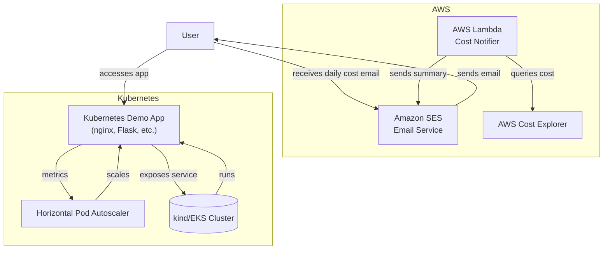

# Architecture Overview

This system consists of two main components:

- **AWS Lambda Cost Notifier:** Queries AWS Cost Explorer daily and sends a summary email via SES.
- **Kubernetes Demo App:** A simple containerized app (nginx) deployed on a kind (or EKS) cluster, with autoscaling and health checks.

## Diagram

## Component Interactions
- The Lambda function runs daily, queries AWS Cost Explorer, and sends a cost summary email via SES.
- The demo app is deployed on Kubernetes, exposed via a Service, and automatically scaled by HPA based on CPU usage.
- Users can access the app via the kind/EKS cluster, and receive cost reports via email. 